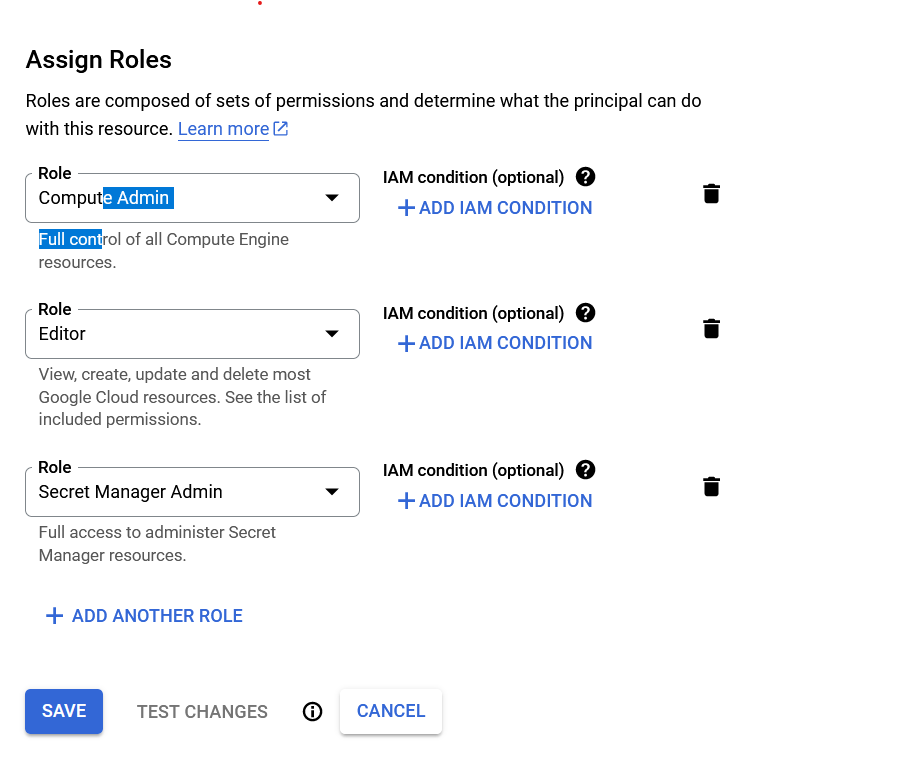

# CKA Lab Setup with Google Cloud and Terraform

Welcome to this CKA (Certified Kubernetes Administrator) lab setup guide! This project provides an automated way to create a Kubernetes cluster using Google Cloud and Terraform.

## Prerequisites

Before you begin, ensure you have the following installed and configured:

- [Google Cloud SDK](https://cloud.google.com/sdk/docs/install)
- [Terraform](https://www.terraform.io/downloads.html)
- A Google Cloud Platform account with appropriate permissions to create resources.

## Step 1: Set Up Google Cloud Service Account

1. Go to the [Google Cloud Console](https://console.cloud.google.com/).
2. Navigate to **IAM & Admin** > **Service Accounts**.
3. Click on **Create Service Account**.
4. Provide a name and description for the service account.
5. Click on **Create and Continue**.
6. Assign the following roles to the service account:
    - Compute Admin
    - Editor
    - Secret Manager Admin

    

7. Click on **Done**.
8. After creating the service account, go to the service account details and create a new key. Download the key file in JSON format and save it to a secure location.

## Step 2: Clone the Repository

```sh
git clone https://github.com/yourusername/cka-lab-setup.git
cd cka-lab-setup
```

## Step 3: Configure Variables

Create a `terraform.tfvars` file in the root of the project and add your GCP credentials and desired configuration:

```hcl
credentials_file = "path-to-your-gcp-credentials-file.json"
project          = "your-gcp-project-id"
region           = "us-west1"
zone             = "us-west1-a"
machine_type     = "e2-medium"
image            = "ubuntu-os-cloud/ubuntu-2004-lts"
service_account_email = "your-service-account-email"
username         = "your-username"
```

## Step 4: Initialize and Apply Terraform

Initialize Terraform:

```sh
terraform init
```

Apply the Terraform configuration:

```sh
terraform apply
```

## Step 5: Accessing the Kubernetes Cluster

After the Terraform configuration completes, your Kubernetes cluster will be ready. The master node will have `kubectl` configured to manage the cluster. You can SSH into the master node to start managing your cluster:

```sh
gcloud secrets versions access latest --secret="kubernetes-key" > ~/.ssh/kubernetes_key && \
chmod 600 ~/.ssh/kubernetes_key && \
ssh-keygen -y -f ~/.ssh/kubernetes_key > ~/.ssh/kubernetes_key.pub && \
gcloud compute ssh --zone "us-west1-a" "k8s-master" --ssh-key-file=~/.ssh/kubernetes_key
```

Once logged into the master node, you can use `kubectl` to manage your cluster.

```sh
kubectl get nodes
```

## Cleanup

To destroy the resources created by Terraform, run:

```sh
terraform destroy
```

## Troubleshooting

If you encounter any issues, please check the logs on the master and worker nodes located in `/var/log/install.log` for detailed error messages.

## Contributing

If you'd like to contribute to this project, please fork the repository and create a pull request with your changes.

## License

This project is licensed under the MIT License. See the [LICENSE](./LICENSE) file for details.

## Contact

For any questions or feedback, please open an issue on GitHub or reach out to me at your-email@example.com.
